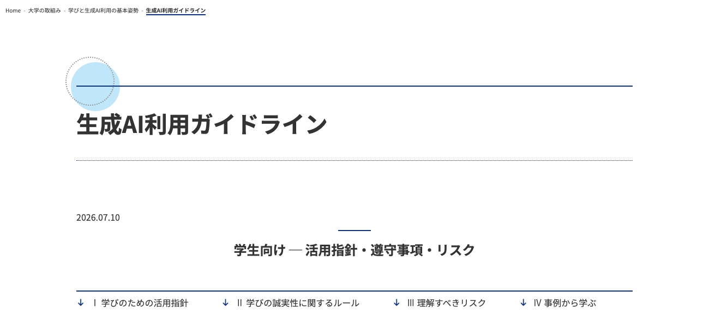
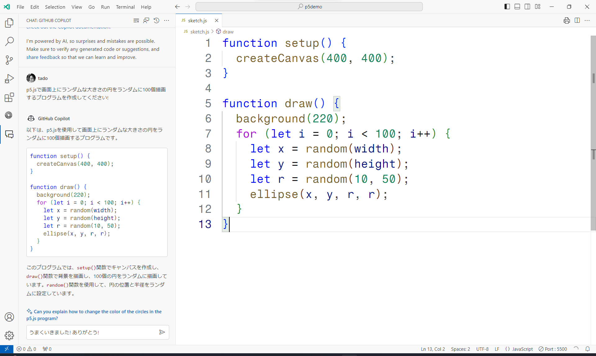

# 人工知能と創作 オリエンテーション
東京藝術大学芸術情報センター
田所 淳

---

<!-- _class: bigtxt -->

## 講義概要

---

この講義では、生成AIの基礎から応用までを幅広く学び、創作におけるAIの可能性を探求します。まず、AIとは何か、ニューラルネットワークや機械学習、そしてディープラーニングといった基本概念を理解することから始めます。その後、プログラミング支援ツールやテキスト、画像、音楽、映像生成などの実例を通して、AIがどのように創作に活用できるかを体験します。AIによる自動化や生成技術がアートやデザインの現場にどのような変革をもたらすのかを探ると同時に、その限界や課題についても批判的に考察します。最終的には、各自が生成AIを活用した創作プロジェクトを企画・発表し、その成果を通じて未来の創作の可能性を展望します。

---

### シラバス紹介

AIの技術的進歩は凄まじく世の中に多大な影響を与えています。アートやデザインといった創作の分野でも無視することのできない存在となっています。この講義は人工知能、特に生成AIの基礎から応用までを探求し、AIを用いた創造的作品を作成するプロセスを探求していきます。まず始めにGoogleのTeachable Machineなどのツールを活用しながらニューラルネットワークや機械学習といったAIの基本を学びます。さらにプログラミング支援、テキストと画像生成、音楽、インタラクティブメディアの生成、映像生成といったAIを活用した創作について掘り下げていきます。ここまでの内容を元に中間発表を行った上で、後半は各受講者が生成AIを用いた創作プロジェクトを企画します。それぞれが企画したプジェクトについて発表し、それを元にディスカッションを行い最終プロジェクトの作成に取り組みます。最後にそれぞれの作品を元にした展覧会を企画し、作品を展示し講評会を行います。

- [Webシラバス](https://cplan-web.off.geidai.ac.jp/Kyoin/web/Syllabus/WebSyllabusSansho/UI/WSL_SyllabusKakunin.aspx?P1=AAM200601&P2=2026&P3=20260401)

---

### 参考文献

[徳井直生 著. 創るためのAI : 機械と創造性のはてしない物語, ビー・エヌ・エヌ, 2021.1. 978-4-8025-1200-8.](https://ndlsearch.ndl.go.jp/books/R100000002-I031203923)

---

[徳井直生 著. つくることとAI : 生成と複製のあいだで, ビー・エヌ・エヌ, 2026.7. 978-4-8025-1355-5.](https://ndlsearch.ndl.go.jp/books/R100000002-I034797198)

---

[レフ・マノヴィッチ, エマニュエーレ・アリエッリ 著ほか. 人工美学 : 生成AI・アート・ビジュアルメディア, ビー・エヌ・エヌ, 2026.7. 978-4-8025-1362-3.](https://ndlsearch.ndl.go.jp/books/R100000002-I034797197)

---

[美術手帖 2024年10月号［AIと創造性］](https://www.amazon.co.jp/dp/B0DDYGH1JS/)

---

### 成績について

履修態度と課題の制作・プレゼンテーションを総合的に評価する。

- 中間課題と最終課題を出題予定
- 課題の評価と各回の講義内での評価で総合的に評価する

---

<!-- _class: bigtxt -->

## イントロダクション

---

## Her (映画)

冒頭部分を視聴

---

Herの世界は既にChat GPTで実現されている!
[https://openai.com/chatgpt/download/](https://openai.com/chatgpt/download/)

---

参考: 
[OpenAIが示した「GPT-4o」の進化と、映画『her／世界でひとつの彼女』との共通項](https://wired.jp/article/openai-gpt-4o-chatgpt-artificial-intelligence-her-movie/)

---

## 生成AIの利用について

生成AI (Generative AI)

* 生成AI提供企業: Google ([Gemini](https://gemini.google.com/))、OpenAI ([ChatGPT](https://chatgpt.com/))、Anthropic ([Claude](https://claude.ai/))、Microsoft ([Copilot](https://copilot.microsoft.com/))、xAI ([Grok](https://grok.com/))、Meta ([Meta AI](https://www.meta.ai/))、[DeepSeek](https://www.deepseek.com/)、[Perplexity](https://www.perplexity.ai/) など
* コード生成AI: [Gemini (Antigravity)](https://antigravity.google/)、[Codex](https://openai.com/codex/)、[Claude (Claude Code)](https://claude.com/product/claude-code)、[GitHub Copilot](https://github.com/features/copilot)、[Cursor](https://cursor.com/)、[Kiro](https://kiro.dev/)、[Lovable](https://lovable.dev/)、[Replit](https://replit.com/) など
* 画像・動画生成AI: [Midjourney](https://www.midjourney.com/)、[Nano Banana](https://gemini.google/overview/image-generation/)、[Veo](https://deepmind.google/models/veo/)、[Adobe Firefly](https://firefly.adobe.com/)、[FLUX](https://bfl.ai/)、[Stable Diffusion](https://stability.ai/)、[Kling](https://klingai.com/)、[Runway](https://runwayml.com/) など
* 音楽・音声生成AI: [Suno](https://suno.com/)、[ElevenLabs](https://elevenlabs.io/) など
* 3D生成AI: [Meshy](https://www.meshy.ai/)、[Tripo](https://www.tripo3d.ai/) など

---

## 生成AIの利用について

生成AI (Generative AI)

  - とてつもないスピードで進化中
  - 文章・画像・動画・音声、そしてプログラムまで生成可能
  - 質問に答えるだけでなく、自律的にコードを書いて実行・修正まで行う「AIエージェント」へ
  - この講義ではどう扱っていくか?

---

## 生成AIの利用について - 芸術系大学のガイドライン

| 大学 | 公表 | ガイドライン |
|---|---|---|
| 武蔵野美術大学 | 2023年5月 / 2026年4月 | [学長メッセージ](https://www.musabi.ac.jp/news/20230511_03_01/)、[レポート等での注意事項](https://www.musabi.ac.jp/news/20260401_03_01/) |
| 東京造形大学 | 2023年 | [生成AIについて (学長メッセージ)](https://www.zokei.ac.jp/news/2023/18898/) |
| 京都芸術大学 | 随時改訂 | [AIの基本方針・ガイドライン](https://www.kyoto-art.ac.jp/info/ai-policy/) |
| 京都精華大学 | 2025年4月 | [生成AIの利用ガイドライン (PDF)](https://www.kyoto-seika.ac.jp/about/report/gjh1lq00000029dg-att/ai_guidelines.pdf) |
| 大阪芸術大学 | 2024年2月 | [生成AI等の使用について](https://www.osaka-geidai.ac.jp/whatsnew/useofai) |

- 多摩美術大学は教職員向けの暫定ガイドラインのみ (学内限定)
- 東京藝術大学は全学的なガイドラインは未公開 → 各授業の方針に従う

---

## 芸術系大学のガイドライン - 武蔵野美術大学 / 東京造形大学

- **武蔵野美術大学**
  - 「まずは自分の目で確かめてみよう」と、生成AIを試して考えることを推奨
  - 生成AIの回答をそのまま **「自分の作品 (自作)」として提出することを禁止**
  - 2026年度からレポート等での利用明記を具体化: **ツール名・利用日・入力したプロンプト・出力内容** を記載
  - 語尾を変える、順番を入れ替える程度の修正も「そのまま使用」とみなす
- **東京造形大学**
  - デザイン・美術での活用を見据え、「何ができて、何ができないのか」を制作の中で考えることを求める
  - 生成AIは自分で考え判断する力を止める **「負の力」にもなりうる** と注意
  - 利用時は箇所と種類を明記、ファクトチェックを習慣に

---

## 芸術系大学のガイドライン - 京都芸術大学 / 京都精華大学

- **京都芸術大学**
  - AIを「創作や研究のプロセスそのものを問い直す環境」と位置づけ、実践的な活用を推進
  - 利用したAIと使い方を明示し、**求めに応じてプロンプトを開示できる状態に**
  - 他者の未公開作品は入力しない、既存作品に酷似した出力を意図的に生成しない (例:「〇〇風の画像」)
  - 「答えを教えない」伴走型AI (Neighbuddy) を授業に導入
- **京都精華大学**
  - 一律に禁止せず、適切に利活用することが基本方針
  - テキスト・画像・音・動画・プログラミングなど生成AI全般が対象
  - 教員の指示がなくても、使用した旨と範囲 (AIの種類・入出力・日時) を明記
  - **明記しなかった場合は不正行為と認定されることも**

---

## 芸術系大学のガイドライン - 大阪芸術大学 / まとめ

- **大阪芸術大学**
  - **アイデアや提案の根幹となる創造性の部分を生成AIに委ねることは禁止**
  - 発覚した場合は評価を取り消すことも
  - 授業での利用は教員の指示に従う場合のみ、利用した旨と箇所を明記
- **芸術系大学に共通する傾向**
  - 全面禁止ではなく、制作や研究での活用を前提にしている
  - 生成物をそのまま「自分の作品」とすることは禁止
  - **利用の明示** (ツール・プロンプト・日時) が求められる方向へ
  - 既存作品への依拠・類似など、著作権への配慮を特に強調

---

## 生成AIの利用について - 京都産業大学のガイドライン

- 参考: [京都産業大学 生成AI利用ガイドライン](https://www.kyoto-su.ac.jp/torikumi/ai-basic-stance/ai-guideline/) (2026年7月)
- 学生向けに「活用指針・遵守事項・リスク」を具体的な事例つきで解説
- 生成AIは使い方と心がけ次第で、学びの支援にも妨げにもなる

---

## 生成AIの利用について - 京都産業大学のガイドライン

- Ⅰ 学びのための活用指針
  - AIを思考の代替ではなく **支援ツール** として活用する
  - ファクトチェックを徹底する
  - アイデア出し、論点整理、プログラミングの補助など、学びの支援として活用する
- Ⅱ 学びの誠実性に関するルール
  - 【最優先】授業ごとの指示・条件を守る
  - AI生成物の無断提出 (丸写し / コピペ) の禁止
  - 課題丸投げ (思考過程丸投げ) の禁止
- Ⅲ 理解すべきリスク
  - バイアスを含んだ情報 / 情報漏洩と個人情報・機密情報 / 著作権侵害

---

## 生成AIの利用について - 京都産業大学のガイドライン

- 課題の丸投げは、長期的には考える力を低下させる **「認知的な借金」** になる
- 学びを損なう利用例
  - 課題を終わらせることだけを目的に、AIに短時間でやらせる
  - 提出物はよくできていても、質問されると自分の言葉で説明できない
  - 卒論のテーマや、自分が何に興味を持つべきかまでAIに決めてもらう
- 不正行為につながる利用例
  - AIが生成した文章をほとんど修正せずに提出する
  - AIが挙げた参考文献を、実在するか確認せずに記載する
  - 自分では説明できない内容を提出する

---

## 生成AIの利用について - 海外の芸術系大学の事例

| 大学 | 国 | ガイドライン |
|---|---|---|
| University of the Arts London (UAL) | 英国 | [Student guide to generative AI](https://www.arts.ac.uk/about-ual/learning-and-teaching/digital-learning/ai-and-education/student-guide-to-generative-ai) |
| Royal College of Art (RCA) | 英国 | [Responsible AI in Art and Design Higher Education (2024)](https://researchonline.rca.ac.uk/5909/1/Responsible%20AI%20Report_final%20version_June2024.pdf) |
| ArtCenter College of Design | 米国 | [Position and Policy on Generative AI](https://www.artcenter.edu/about/get-to-know-artcenter/policies-and-disclosures/artcenter-position-and-policy-on-generative-ai.html) |
| School of Visual Arts (SVA) | 米国 | [AI Statement and Guidelines](https://sva.edu/academics/academic-resources/ai-statement-and-guidelines) |
| Berklee College of Music | 米国 | [Guiding Principles for AI/Machine Learning](https://www.berklee.edu/about/ai-machine-learning) |

---

## 海外の芸術系大学の事例 - UAL / ArtCenter

- **University of the Arts London (イギリス)**
  - 生成AIの利用を記録し、どのツールをどう使ったかを明示する
  - 創作上の判断は自分で行う (**authorship を保つ**)
  - 学習データに使われない「保護された」ツール (Copilot、Adobe Firefly) を推奨
  - AIのエネルギー消費やバイアスを問い、**気候正義・脱植民地主義** の観点から利用を選択する
- **ArtCenter College of Design (アメリカ)**
  - 教員がシラバスで **「禁止 / 条件付き許可 / 積極的に活用」** の3つから選ぶ
  - アイデア出し・試作・最終作品など、どの段階で使えるかも指定
  - 利用時は **ツール名・プロンプト全文・企業名・日付・URL** を記載
  - 環境負荷を考慮した「慎重な利用」を推奨

---

## 海外の芸術系大学の事例 - SVA / Berklee

- **School of Visual Arts (アメリカ)**
  - 生成AIを「使う道具」だけでなく **「探求と省察の対象」** として扱う
  - 生成AIリテラシーを大学全体の学習成果と位置づける
  - AI検出ツールには頼らず、疑わしい場合は **学生に制作プロセスを説明してもらう**
  - 入試ではAIで完全に生成した画像は不可 (AIによる補正は可)
- **Berklee College of Music (アメリカ)**
  - 「アーティストとして」「アーティストの擁護者として」「芸術教育者として」の3原則
  - AI開発において **アーティストの権利・クレジット・同意** を中心に据える
  - 生成音楽AI企業とは提携しないことを明言
  - AIの利用は学生にも教員にも義務づけない (授業ごとに判断)

---

## 海外の芸術系大学の事例 - RCA / まとめ

- **Royal College of Art (イギリス)**
  - 学生・教職員187名を調査した報告書 (2024)
  - 66%がAIを利用 (チャットAI 80%、画像生成 56%)、一方で多くは独学
  - 懸念: 人権、社会的信頼、**知的所有権**、著作権、バイアスの再生産
  - 明確な指針、授業やワークショップ、計算資源の整備を提言
- **海外の事例に共通する傾向**
  - 授業ごとに教員が方針を決め、利用時の明示を求める点は国内と共通
  - 環境負荷やバイアス、アーティストの権利など **倫理的・社会的な問い** をより重視
  - 検出ツールで取り締まるより、制作プロセスを説明できることを重視

---

## 生成AIの利用について

- この講義では (他の講義についてはその指示に従う)
  - 生成AIは基本的に使用しても良い
  - ただ結果をそのままコピペするのではなく、より生産的な使用方法を考える
  - 生成された結果が誤りである可能性を常に考慮する
    - ソースにあたる (Web検索機能を使うと、多くの生成AIで出典が表示される)
    - 生成AIと検索を併用する
    - ...など
- いろいろ試行錯誤しながら一緒に考えていきましょう!

---

## 生成AIの利用について - Gemini 学割プラン

- 参考: [Google Gemini 学割プラン](https://gemini.google/jp/students/?hl=ja) : Google AI Plus が **1年間無料**
  - 18歳以上の大学生が対象、2026年12月31日までに登録
  - Geminiの利用上限が2倍、400GBのストレージ、学習ノートブック、Gemini Live など
  - 登録時に支払い方法の登録が必要 (解約しなければ無料期間後は毎月¥725)
- 注意: 個人のGoogleアカウントでの契約なので、大学が契約するサービスのようなデータ保護はない
  - 個人情報・機密情報は入力しない

---

## 生成AIの利用について

- 参考: [Text-GPT-p5](https://text-gpt-p5.vercel.app/)
- この講義で使用する p5.js のコードをGPT-4o-miniを用いて対話的に生成!
- オープンソース!

---

## 生成AIの利用について

- 参考その2: [p5.CodingWithAI](https://kyabe.net/works/p5-coding-with-ai/)
- きゃべさんによる、p5.jsのコードを生成AIで対話的に生成するためのツール

---

<!-- _class: bigtxt -->

# 生成AIを使用したプログラミングのデモ

---

## 生成AIを使用したプログラミングのデモ

- p5.js (この講義で使用する環境) + GitHub Copilot (コード生成)
- 設定方法などはまた後日解説します!

---

## 人工知能と創作2025

昨年度のこの講義の内容をざっと紹介

- [人工知能と創作 2025 講義資料一覧](https://yoppa.org/geidai-ai25)

---

## 人工知能と創作2025 - 講義一覧 (1)

1. [人工知能と創作 - オリエンテーション](https://yoppa.org/geidai-ai25/18353.html)
2. [人工知能、機械学習、深層学習、生成AI / Teachable Machineで機械学習体験](https://yoppa.org/geidai-ai25/18400.html)
3. [Transformer - ChatGPTへ至る30年の歴史 / 画像生成AI導入](https://yoppa.org/geidai-ai25/18478.html)
4. [「AI生成自画像」講評 / 生成芸術の歴史と未来](https://yoppa.org/geidai-ai25/18524.html)
5. [動画生成AIを使ってみる](https://yoppa.org/geidai-ai25/18559.html)
6. [生成動画「幻覚 - バッド・トリップ」講評 / AIと音楽制作](https://yoppa.org/geidai-ai25/18618.html)

---

## 人工知能と創作2025 - 講義一覧 (2)

7. [AIを活用したプログラミング入門](https://yoppa.org/geidai-ai25/18650.html)
8. [最終課題制作のヒント1 - 画像生成: 生成コレクション / 合成的分類学 / ポスト・フォトグラフィー](https://yoppa.org/geidai-ai25/18716.html)
9. [最終課題制作のヒント2 - 生成AIとスペキュラティブ・デザイン](https://yoppa.org/geidai-ai25/18747.html)
10. [最終課題制作のヒント3 - 機械学習ライブラリーを使ってみる MediaPipeとml5.js](https://yoppa.org/geidai-ai25/18870.html)
11. [最終課題制作のヒント4 - AI Creative Future Awardsの受賞作品紹介](https://yoppa.org/geidai-ai25/18963.html)

---

## 人工知能と創作2025 - 各回の内容 (1)

- **第1回 オリエンテーション**
  - 講義の目的と構成、生成AIを検索エンジンの登場になぞらえた講義でのスタンス
- **第2回 人工知能、機械学習、深層学習、生成AI**
  - AI・機械学習・深層学習・生成AIの違いと関係を整理
  - Teachable Machineで「画像の読み込み → ラベル付け → 学習 → 分類」を体験
- **第3回 Transformer / 画像生成AI導入**
  - RNNからTransformer、GPTに至る30年の歴史とアテンション機構の仕組み
  - Gemini、Midjourney、Adobe Fireflyなど画像生成AIを比較
  - 課題: 画像生成AIで **「AI生成自画像」** を制作

---

## 人工知能と創作2025 - 各回の内容 (2)

- **第4回 「AI生成自画像」講評 / 生成芸術の歴史と未来**
  - Vera Molnár、Harold Cohen、Casey Reas、Refik Anadolなど生成芸術の系譜
  - 美術館でのAIアート展示と、その評価のされ方
- **第5回 動画生成AIを使ってみる**
  - GAN → 拡散モデル → Transformer という動画生成の技術の変遷
  - Sora 2、Veo 3.1、Runway、Klingなどを比較、DaVinci Resolveで編集
  - 課題: 生成動画 **「幻覚 - バッド・トリップ」**
- **第6回 生成動画講評 / AIと音楽制作**
  - AI DJ Project、Holly Herndon、ビートルズ「Now And Then」などの事例
  - Suno、MusicFX DJ、Neutone Morphoで音楽を生成し、映像と組み合わせる

---

## 人工知能と創作2025 - 各回の内容 (3)

- **第7回 AIを活用したプログラミング入門**
  - p5.jsの基礎と、ChatGPT・p5.CodingWithAI・GitHub Copilotでのコード生成
- **第8回 最終課題制作のヒント1 - 画像生成**
  - 大量生成による **生成コレクション**、架空の生物を生む **合成的分類学** (Sofia Crespo)
  - 写真データセットから「集合的記憶」を描く **ポスト・フォトグラフィー**
- **第9回 最終課題制作のヒント2 - スペキュラティブ・デザイン**
  - 「問題解決」ではなく「問題提起」のデザイン (Dunne & Raby)
  - SPACE10、Lauren Lee McCarthy「LAUREN」、Holly Herndon「Holly+」など

---

## 人工知能と創作2025 - 各回の内容 (4)

- **第10回 最終課題制作のヒント3 - MediaPipeとml5.js**
  - 顔・手・ポーズの検出など、コンピュータビジョンの基礎
  - ml5.js (BodyPose、HandPose、FaceMesh) と p5.js でインタラクションを作る
- **第11回 最終課題制作のヒント4 - AI Creative Future Awards**
  - グランプリ「Cyber Subin」(タイ伝統舞踊とAIの共創) などの受賞作品
  - 技術の高度さより **「何を問い直すか」「社会にどう関わるか」** が評価される
- **最終課題**: 生成AIを用いた創作プロジェクトを企画・制作・発表

---

## 今年度の人工知能と創作2026

- 基本的には昨年度の内容を踏襲したい
- ただし、生成AIの技術は日進月歩で進化している
- 今年度は昨年度の内容をベースにしつつ、最新の生成AIの技術やサービスを取り入れていく
- 今年度は昨年度よりもさらに実践的な内容にしていきたい
- 今年度も最終的には生成AIを用いた創作プロジェクトを企画・制作・発表する

---

## アンケート

本日の講義に参加した方は以下のアンケートに答えてください。

- [アンケートフォーム](https://forms.gle/UGjV8crMspV6PmHM6)

